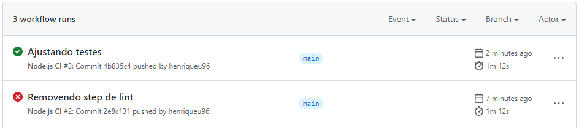

# Publicando projeto angular no Heroku com Github Actions (CI/CD)

## Integração Contínua e o GitHub Actions

## Por que utilizar o Heroku?
Atualmente existem diversas opções de provedores e serviços na nuvem, o Heroku
é uma dessas opções para o segmento de PaaS.

O PaaS, plataforma como serviço, abstrai do desenvolvedor os detalhes e o trabalho da elaboração
de uma infraestrutura para aplicações, além de poder escalar essas aplicações
de acordo com a necessidade de processamento e uso.

O Heroku suporta Ruby, Java, Clojure, Python, Scala e Node,
permitindo ao desenvolvedor evitar os gastos e a complexidade de comprar
e gerenciar licenças de software, infraestrutura e middlewares.

## Pré requisitos

Ter o node e o angular cli instalados, além de ter um repositório no github
e uma conta gratuita no Heroku.

___
## Passo a Passo

No geral, serão alguns passos para configurar CI e CD com github e heroku
- Criar um projeto angular
- Adicionar o projeto no github
- Adaptando os scripts npm para CI/CD
- Adicionando a action ao projeto
- Habilitando o deploy automático Heroku

___
### Criar um projeto angular
Para iniciar, é necessário criar um projeto angular a partir do CLI
```
ng new
```
Crie o projeto com suas preferências de nome e ferramenta de estilo

___
### Adicionar o Github como repositório remoto
Na pasta do projeto gerado, adicione o github como seu repositório remoto
````
git remote add origin https://github.com/{seu-usuário}/{seu-repositório}.git
git push -u origin master
````

___
### Script para compilar e rodar
Como o Heroku não dá suporte direto ao angular, e sim ao node, então
fazemos o build com o angular CLI e usamos o node para distribuir
esse build.

Já com o projeto angular iniciado, vamos adicionar duas dependencias:
````
npm install express path --save
````

Além disso, é preciso criar um arquivo, na raiz do projeto, que inicie o serviço:
``service.js``
````
const express = require('express')
const path = require('path')

const app = express()
const appName = 'NOME DO APP'
app.use(express.static(`${__dirname}/dist/${appName}`))

app.get('/', (req, res) => {
  res.sendFile(path.join(`${__dirname}/dist/${appName}/index.html`))
});

console.log('App running')
app.listen(process.env.PORT || 8080);
````
É importante mudar a variável appName para o mesmo nome do aplicativo do angular
que você escolheu no angular cli.
O script start será o responsável por demonstrar ao Heroku 
como iniciar o App.

Esses scripts ficam no arquivo ``package.json``.

````
"scripts": {
  ...
  "build": "ng build",
  "start": "node server.js",
  ...
}
````

___
### Scripts de teste
Para que o deploy aconteça somente quando os testes passarem, temos que 
ajustar o script de testes para uma versão que rode uma unica vez os testes e
mostre o resultado. Além disso, podemos escolher um navegador mais rápido
e que utilize menos recurso, que se chama ChromeHeadless.

````
"scripts": {
  ...
  "test": "ng test --watch=false --browsers ChromeHeadless",
  ...
}
````

IMPORTANTE: O script de testes padrão do angular roda no navegador chrome e não retorna sucesso,
se esse script não for alterado, o github não vai interromper esse processo e não saberá
se os testes passaram ou não, congelando o build.

___
### Adicionando o Github Action

Para adicionar a action, é preciso criar o arquivo 
``.github/workflows/node.js.yml``
````
name: Node.js CI

on:
  push:
    branches: [ main ]
  pull_request:
    branches: [ main ]

jobs:
  build:

    runs-on: ubuntu-latest

    strategy:
      matrix:
        node-version: [16.x]

    steps:
    - uses: actions/checkout@v3
    - name: Use Node.js ${{ matrix.node-version }}
      uses: actions/setup-node@v3
      with:
        node-version: ${{ matrix.node-version }}
        cache: 'npm'
    - run: npm ci
    - run: npm run build
    - run: npm test
````

Criado esse arquivo, ao fazer o push para a branch main a action irá
aparecer lá na aba actions do github:  


Agora, quando o push for feito, o github vai compilar o projeto e rodar os testes, indicando se o commit passou pelas 
validações ou falhou.



___
## Adicionando deploy no Heroku
Primeiramente é necessário criar um novo app no Heroku


Após criado, vamos conectar o app com o github


Habilitar o deploy automático, adicionando a opção de esperar pipeline para
fazer o deploy. 


Pronto! Agora toda vez que o github receber um push na branch main, o app será
compilado e testado, e se passar, será feito o deploy no Heroku.

Referências:
https://www.devmedia.com.br/primeiros-passos-em-paas-com-heroku/29465
https://azure.microsoft.com/pt-br/overview/what-is-paas/

1. Plataforma como serviço
___
Autor: Henrique Felipe Urruth
Data: 25/05/2022
